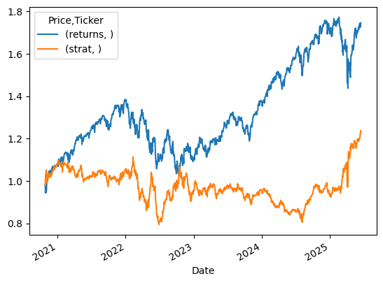

# Out-of-Sample Results

The initial out-of-sample backtest provided a valuable first look at the strategy's performance, yielding some clear observations.

- Over the test period, a simple **buy-and-hold strategy** for the S&P 500 achieved a total return of **74.54%**.  
- In contrast, the **linear regression-based strategy** generated a total return of **23.72%**.

This outcome indicates that, in its current form and with the chosen features, the model **significantly underperformed** the market benchmark.

Upon further research and reflection, this result is **not entirely unexpected**.

My initial hypothesis centered on identifying linear relationships between lagged returns and future market movements. However, deeper dives into quantitative finance literature and market behavior reveal that:

- Stock market dynamics are inherently **complex** and often exhibit **non-linear characteristics**.  
- The **efficient market hypothesis**, particularly for highly liquid indices like the S&P 500, suggests that readily available historical price data alone may **not offer consistently exploitable linear patterns**.

This understanding underscores the limitations of a basic linear model in capturing the nuanced and often unpredictable nature of real-world financial markets.

